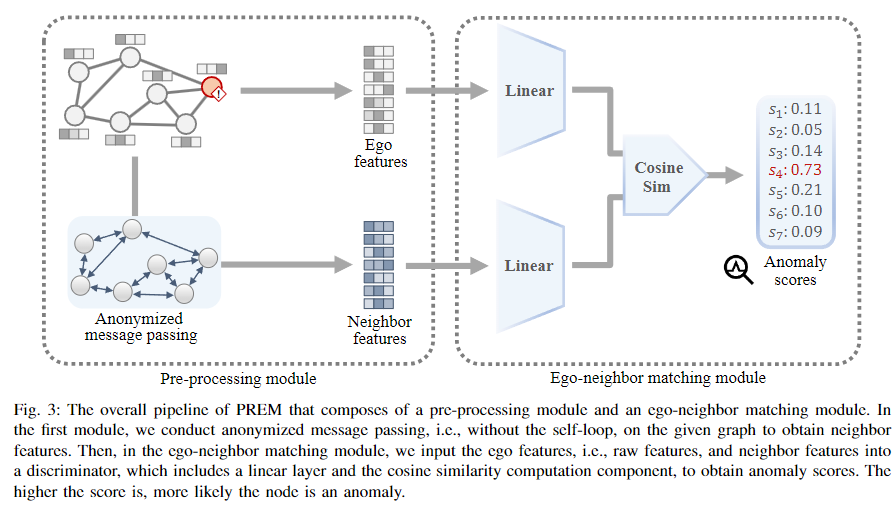

# PREM-A-Simple-Yet-Effective-Approach-for-Node-Level-Graph-Anomaly-Detection
This repo is the official implementation of [ICDM23 PREM: A Simple Yet Effective Approach for Node-Level Graph Anomaly Detection](https://arxiv.org/abs/2310.11676)

     
To reproduce the results, 

### Cora

'''

'''
